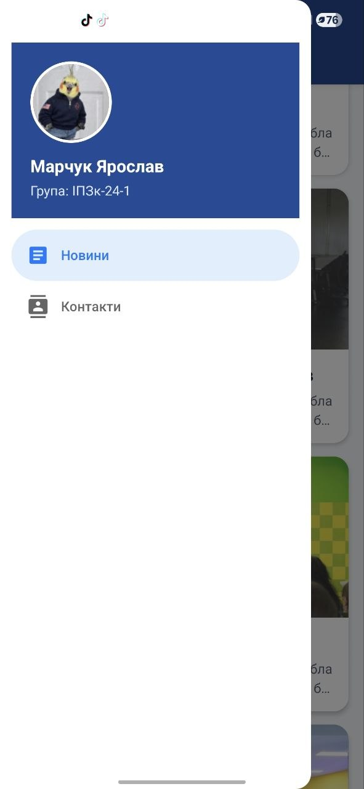

# Лабораторна робота №2

**Тема:** Побудова вкладеної навігації та оптимізація відображення великих списків у React Native із використанням компонентів FlatList та SectionList.

## Інструкція запуску

```bash
cd MobileLabsRN2026/lab2
npm install
npx expo start
```

Після запуску можна відкрити застосунок в Expo Go, Android Emulator, iOS Simulator або web-режимі.

## Реалізований функціонал

- Створено Expo React Native застосунок.
- Реалізовано вкладену навігацію:
  - Drawer Navigator;
  - Stack Navigator для екранів `MainScreen` і `DetailsScreen`.
- Усунуто подвійний header за допомогою `headerShown: false` для вкладеного Stack у Drawer.
- Реалізовано передачу параметрів із `MainScreen` у `DetailsScreen`.
- Реалізовано динамічний заголовок екрана деталей на основі назви новини.
- Створено список новин через `FlatList`:
  - `refreshing`;
  - `onRefresh`;
  - імітація мережевого запиту через `setTimeout`;
  - infinite scroll через `onEndReached` і `onEndReachedThreshold`;
  - `ListHeaderComponent`;
  - `ListFooterComponent`;
  - `ItemSeparatorComponent`;
  - параметри оптимізації `initialNumToRender`, `maxToRenderPerBatch`, `windowSize`.
- Створено екран контактів через `SectionList`:
  - `sections`;
  - `renderItem`;
  - `renderSectionHeader`;
  - `keyExtractor`;
  - `ItemSeparatorComponent`.
- Створено кастомний Drawer Menu з:
  - аватаром;
  - ПІБ;
  - групою;
  - пунктом меню «Новини»;
  - пунктом меню «Контакти».

## Скріншоти роботи застосунку

### Новини


### Нескінченний скрол новин


### Оновлення сторінки (Pull-to-Refresh)


### Drawer меню


### Деталі новини


### Контакти (SectionList)


## Контрольні запитання та висновки

### 1. Чим відрізняється FlatList від ScrollView?

`ScrollView` рендерить усі елементи одразу, тому для великих списків може споживати багато пам’яті та знижувати продуктивність. `FlatList` рендерить лише видимі елементи та частину елементів поруч із ними, тому краще підходить для великих списків.

### 2. Що таке віртуалізація списків?

Віртуалізація списків — це механізм, за якого на екрані створюються тільки ті елементи, які зараз видимі або можуть скоро стати видимими. Невидимі елементи не тримаються постійно в пам’яті, що покращує продуктивність.

### 3. Як здійснюється передача параметрів між екранами?

Параметри передаються через метод `navigation.navigate`. Наприклад:

```js
navigation.navigate('Details', { news: item });
```

На екрані деталей параметри можна отримати через `route.params`.

### 4. Що таке вкладена навігація?

Вкладена навігація — це структура, у якій один навігатор міститься всередині іншого. У цій роботі `Drawer Navigator` містить `Stack Navigator`, який керує переходами між головним екраном новин і екраном деталей.

### 5. У яких випадках застосовується SectionList?

`SectionList` застосовується, коли дані потрібно показати групами або секціями. Наприклад: контакти за категоріями, товари за розділами, повідомлення за датами.

## Висновок

У ході лабораторної роботи було створено мобільний застосунок на React Native з вкладеною навігацією Drawer + Stack. Було реалізовано ефективне відображення великого списку новин через FlatList, механізми Pull-to-Refresh та Infinite Scroll, а також групований список контактів через SectionList. Практично закріплено передачу параметрів між екранами, налаштування динамічних заголовків і кастомізацію бокового меню.

