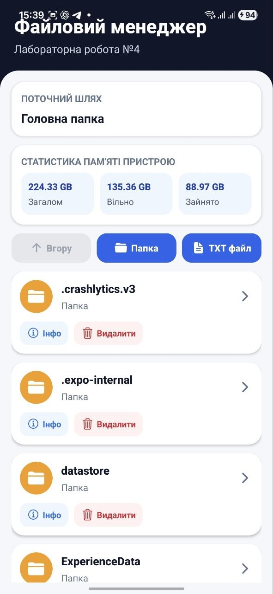
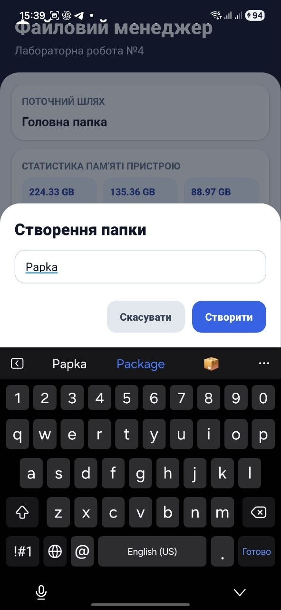
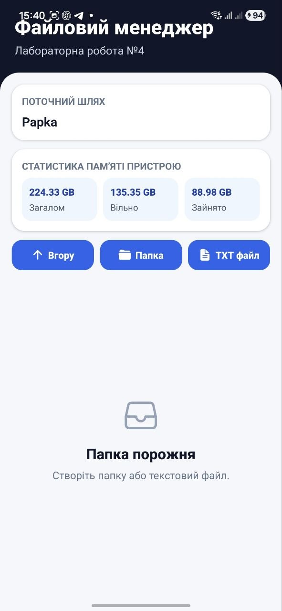
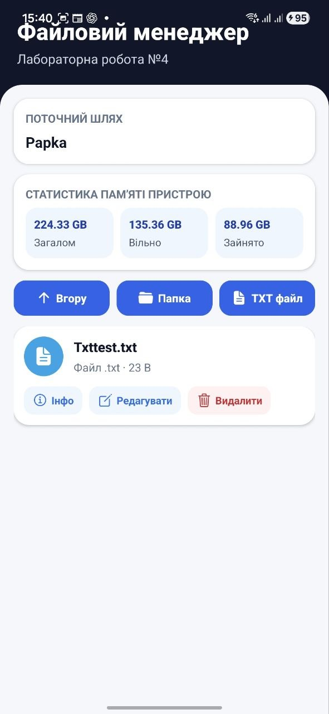
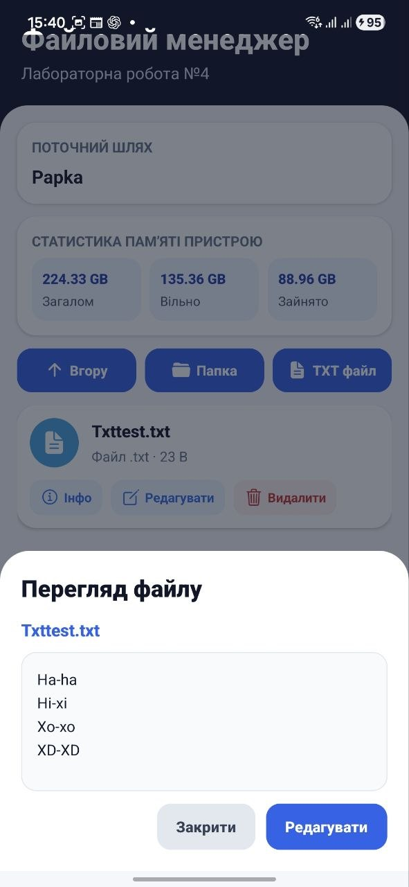
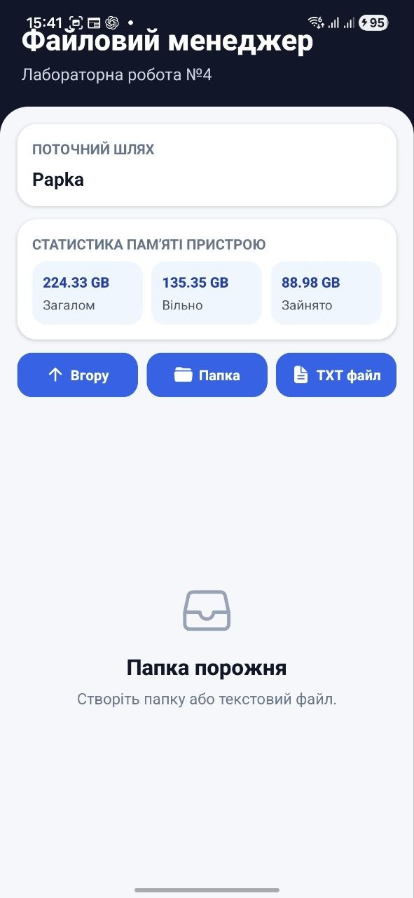
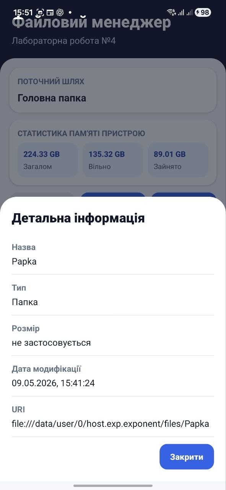

# Лабораторна робота №4

## Тема

Робота з файловою системою в React Native з використанням бібліотеки `expo-file-system`.

## Виконав

Студент групи **ІПЗк-24-1**  
**Марчук Ярослав**

## Опис проєкту

У цій лабораторній роботі я розробив мобільний застосунок **«Файловий менеджер»**. Застосунок дозволяє працювати з локальною файловою системою мобільного додатку: переглядати папки та файли, створювати нові папки, створювати текстові файли, відкривати їх, редагувати, видаляти та переглядати детальну інформацію про об’єкти файлової системи.

Для роботи з файловою системою я використав бібліотеку `expo-file-system`.

## Реалізований функціонал

У застосунку реалізовано такі можливості:

- перегляд поточного шляху у файловій системі додатку;
- відображення списку файлів і папок поточної директорії;
- перехід у вкладені папки;
- повернення до попередньої директорії через кнопку **«Вгору»**;
- створення нової папки з введеною назвою;
- створення нового `.txt` файлу з введеним ім’ям і початковим вмістом;
- відкриття `.txt` файлів для перегляду їх вмісту;
- редагування текстових файлів;
- збереження змін у відповідний файл;
- видалення файлів і папок;
- підтвердження перед видаленням;
- перегляд детальної інформації про файл або папку;
- перегляд статистики пам’яті пристрою на головному екрані.

## Інформація про файл

Для кожного об’єкта можна переглянути детальну інформацію:

- назву;
- тип файлу або папки;
- розмір файлу;
- дату останньої модифікації;
- URI об’єкта у файловій системі додатку.

## Статистика памʼяті

На головному екрані застосунку виводиться:

- загальний обсяг памʼяті пристрою;
- обсяг вільного простору;
- обсяг зайнятого простору.

## Використані технології

У проєкті використано:

- `React Native`;
- `Expo`;
- `expo-file-system`;
- `TypeScript`;
- `FlatList` для відображення списку файлів і папок;
- `TextInput` для введення назв і тексту;
- `Modal` для створення, перегляду, редагування та перегляду інформації.

## Інструкція запуску

Спочатку потрібно встановити залежності:

```bash
npm install
```

Після цього можна запустити проєкт:

```bash
npx expo start -c
```

Після запуску потрібно відсканувати QR-код через застосунок **Expo Go** на телефоні.

Також можна запустити проєкт на Android-емуляторі:

```bash
npm run android
```

## Скріншоти роботи застосунку

### Головний екран файлового менеджера



*Рисунок 1 - Головний екран файлового менеджера зі статистикою пам’яті пристрою.*

### Створення нової папки



*Рисунок 2 - Модальне вікно для створення нової папки.*

### Перехід у створену папку



*Рисунок 3 - Перехід у створену папку та відображення поточного шляху.*

### Створення текстового файлу



*Рисунок 4 - Створення текстового файлу з початковим вмістом.*

### Перегляд текстового файлу



*Рисунок 5 - Перегляд вмісту створеного текстового файлу.*

### Редагування текстового файлу


*Рисунок 6 - Редагування текстового файлу та зміна його вмісту.*

### Видалення файлу



*Рисунок 7 - Результат видалення файлу з поточної папки.*

### Детальна інформація про файл або папку



*Рисунок 8 - Перегляд детальної інформації про об’єкт файлової системи.*

## Висновок

Під час виконання лабораторної роботи я навчився працювати з локальною файловою системою мобільного застосунку за допомогою `expo-file-system`. Я реалізував базові операції з файлами та папками: створення, перегляд, редагування, видалення і перегляд детальної інформації.

Також у застосунку було реалізовано навігацію між папками, відображення поточного шляху та статистику памʼяті пристрою. У результаті було створено мобільний файловий менеджер, який відповідає вимогам лабораторної роботи.
