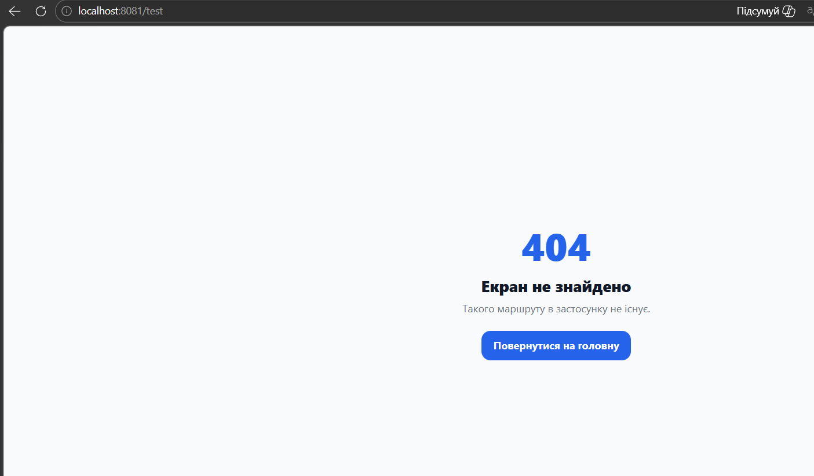

# Лабораторна робота №5

## Тема

Побудова навігації у React Native із використанням бібліотеки **Expo Router**.

## Виконав

Студент групи **ІПЗк-24-1**  
**Марчук Ярослав**

## Опис проєкту

У цій лабораторній роботі я розробив мобільний застосунок з використанням **Expo Router** та file-based маршрутизації. У застосунку реалізовано публічні екрани входу й реєстрації, глобальний контекст авторизації, захищену групу маршрутів, каталог товарів, динамічний екран деталей товару та сторінку для неіснуючих маршрутів.

Основна ідея застосунку полягає в тому, що неавторизований користувач може бачити тільки екрани входу та реєстрації. Після авторизації користувач переходить до захищеної частини застосунку, де відображається каталог товарів.

## Реалізований функціонал

У застосунку я реалізував такі можливості:

- file-based маршрутизацію через директорію `app`;
- кореневий layout `app/_layout.jsx`;
- групу публічних маршрутів `app/(auth)`;
- групу захищених маршрутів `app/(app)`;
- глобальний контекст авторизації `AuthContext`;
- функцію входу `login(email, password)`;
- функцію реєстрації `register(email, password, name)`;
- функцію виходу `logout()`;
- екран входу з полями Email і Пароль;
- екран реєстрації з полями Імʼя, Email, Пароль і Підтвердження паролю;
- автоматичне перенаправлення неавторизованого користувача на `/login`;
- каталог товарів із використанням `FlatList`;
- картки товарів із зображенням, назвою та ціною;
- перехід на деталі товару через компонент `Link asChild`;
- динамічний маршрут `app/(app)/details/[id].jsx`;
- отримання параметра `id` через `useLocalSearchParams`;
- відображення повної інформації про товар;
- сторінку `+not-found.jsx` для неіснуючих маршрутів.

## Структура маршрутизації

У проєкті використано таку структуру маршрутів:

```text
app/
  _layout.jsx
  index.jsx
  +not-found.jsx
  (auth)/
    _layout.jsx
    login.jsx
    register.jsx
  (app)/
    _layout.jsx
    index.jsx
    details/
      [id].jsx
context/
  AuthContext.jsx
data/
  products.js
```

Групи маршрутів `(auth)` та `(app)` використовуються для логічного розділення екранів. Назви цих груп не потрапляють у кінцевий URL застосунку.

## Авторизація

Стан авторизації зберігається у глобальному контексті `AuthContext`. У ньому зберігається значення `isAuthenticated`, дані користувача та функції `login`, `register` і `logout`.

Для тестового входу можна використати:

```text
Email: demo@gmail.com
Пароль: 123456
```

Якщо користувач не авторизований і намагається відкрити захищену частину застосунку, layout у папці `app/(app)` автоматично перенаправляє його на екран входу.

## Каталог товарів

На головному екрані захищеної частини застосунку відображається каталог товарів. Список товарів створено на основі тестового масиву даних у файлі `data/products.js`.

Кожна картка товару містить:

- зображення;
- категорію;
- назву товару;
- ціну.

При натисканні на картку користувач переходить на сторінку деталей відповідного товару.

## Динамічні маршрути

Для сторінки деталей товару використано динамічний маршрут:

```text
app/(app)/details/[id].jsx
```

Параметр `id` отримується за допомогою хука `useLocalSearchParams`. Після цього застосунок знаходить потрібний товар у масиві даних і відображає його детальну інформацію.

## Інструкція запуску

Спочатку потрібно встановити залежності:

```bash
npm install
```

Після цього можна запустити проєкт:

```bash
npx expo start -c
```

Після запуску потрібно відсканувати QR-код через застосунок **Expo Go** на телефоні.

Також можна запустити проєкт на Android-емуляторі:

```bash
npm run android
```

## Основні залежності

У проєкті використано такі основні бібліотеки:

- `expo`;
- `expo-router`;
- `react`;
- `react-native`;
- `react-native-gesture-handler`;
- `react-native-safe-area-context`;
- `react-native-screens`;
- `react-native-reanimated`;
- `typescript`.

## Скріншоти роботи застосунку

### Екран входу


*Рисунок 1 - Публічний екран входу з полями Email і Пароль.*

### Екран реєстрації


*Рисунок 2 - Публічний екран реєстрації нового користувача.*

### Каталог товарів


*Рисунок 3 - Захищений екран каталогу товарів після авторизації.*

### Деталі товару


*Рисунок 4 - Динамічний маршрут з детальною інформацією про товар.*

### Сторінка неіснуючого маршруту



*Рисунок 5 - Екран обробки неіснуючого маршруту.*

## Висновки та відповіді на контрольні запитання

### 1. Яким чином за допомогою Expo Router реалізується перенаправлення неавторизованого користувача?

Перенаправлення реалізується у layout-файлі захищеної групи маршрутів. У моєму проєкті це файл `app/(app)/_layout.jsx`. У ньому перевіряється значення `isAuthenticated` з глобального контексту авторизації. Якщо користувач не авторизований, компонент повертає:

```jsx
<Redirect href="/login" />
```

Таким чином користувач автоматично потрапляє на екран входу.

### 2. У чому полягає різниця між використанням компонента `<Link>` та метода `router.push()`?

Компонент `<Link>` використовується як декларативний спосіб переходу між екранами. Він зручний тоді, коли перехід привʼязаний до елемента інтерфейсу, наприклад текстового посилання або картки товару.

Метод `router.push()` використовується імперативно, тобто викликається у JavaScript-коді після певної дії. Наприклад, його можна використати після перевірки форми або виконання логіки авторизації.

### 3. Як працюють динамічні маршрути в Expo Router і як отримати передані параметри?

Динамічні маршрути створюються за допомогою квадратних дужок у назві файлу. Наприклад, файл `[id].jsx` означає, що частина маршруту буде змінним параметром.

У моєму проєкті використано маршрут:

```text
app/(app)/details/[id].jsx
```

Параметр `id` отримується за допомогою хука:

```jsx
const { id } = useLocalSearchParams();
```

Після цього за отриманим `id` знаходиться потрібний товар у масиві даних.

### 4. Чому стан авторизації доцільно зберігати у глобальному контексті, а не в локальному стані компонента?

Стан авторизації потрібен одразу в декількох частинах застосунку: на екрані входу, реєстрації, у захищеному layout, на головному екрані та при виході з акаунту. Якщо зберігати цей стан локально в одному компоненті, інші екрани не зможуть зручно отримати до нього доступ.

Глобальний контекст дозволяє централізовано зберігати `isAuthenticated`, дані користувача та функції входу, реєстрації й виходу. Це робить логіку авторизації зрозумілішою та зручнішою для підтримки.

### 5. Для чого використовуються групи маршрутів `(folderName)` і як вони впливають на URL-адресу?

Групи маршрутів використовуються для логічного розділення екранів у структурі проєкту. Наприклад, у моєму застосунку є група `(auth)` для публічних екранів і група `(app)` для захищених екранів.

Назва групи в круглих дужках не додається до URL-адреси. Тобто файл `app/(auth)/login.jsx` відкривається за маршрутом `/login`, а не `/(auth)/login`. Це дозволяє зручно організовувати структуру проєкту без зайвих частин у маршрутах.

## Висновок

Під час виконання лабораторної роботи я ознайомився з принципом file-based маршрутизації в Expo Router. Я навчився створювати публічні та захищені групи маршрутів, використовувати layout-файли, реалізовувати перенаправлення користувача залежно від стану авторизації та створювати динамічні маршрути.

У результаті було створено мобільний застосунок із авторизацією, реєстрацією, каталогом товарів, деталями товару та обробкою неіснуючих маршрутів.
